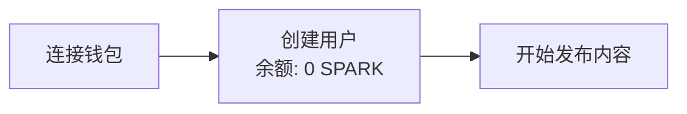
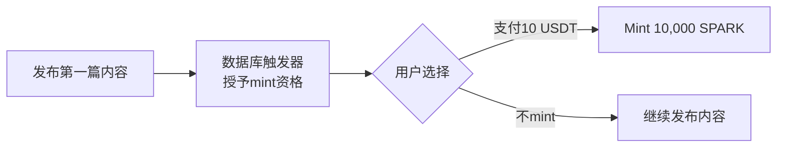
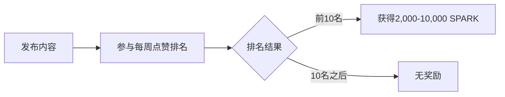
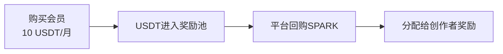

# 新经济模型实现总结

## ✅ 已完成的修改

### 1. 核心经济逻辑修复 ✅

#### 修改的文件：
- `App.tsx` - 移除发帖自动奖励
- `services/supabaseService.ts` - 移除初始代币奖励

#### 关键变更：
```typescript
// 旧逻辑（已删除）
const postReward = user.dailyPostCount < DAILY_POST_LIMIT ? 10 : 3;
await updateUserTokens(address, postReward);

// 新逻辑
// 发帖不给代币，只记录发帖
// 前2000名自动获得mint资格（数据库触发器）
```

```typescript
// 旧逻辑（已删除）
tokens: ECONOMY_CONFIG.INITIAL_TOKENS, // 20代币

// 新逻辑
tokens: 0, // 初始为0，需要通过mint获得
```

---

### 2. 创建了3个新的UI组件 ✅

#### A. `components/MintPanel.tsx` 🎁
**功能：**
- 显示mint资格状态
- 显示剩余名额（前2000名）
- 显示用户USDT和SPARK余额
- 授权USDT并执行mint操作
- 支付10 USDT mint 10,000 SPARK

**集成的智能合约：**
- `MintController` - 管理mint逻辑
- `USDT` - 支付代币
- `SparkToken` - 获得代币

---

#### B. `components/MembershipPanel.tsx` 👑
**功能：**
- 显示会员状态（激活/未激活）
- 显示剩余天数
- 购买/续费会员（10 USDT/月）
- 授权USDT并执行购买操作

**集成的智能合约：**
- `MembershipManager` - 管理会员
- `USDT` - 支付代币

**经济流转：**
- 会员费用100%进入RewardPool
- 用于回购SPARK并奖励创作者

---

#### C. `components/WeeklyRankingPanel.tsx` 🏆
**功能：**
- 显示本周实时排名（前10名）
- 显示上周排名和奖励
- 领取上周奖励
- 显示每个排名对应的SPARK奖励金额

**集成的智能合约：**
- `RewardPool` - 领取奖励

**奖励分配：**
- 第1名：10,000 SPARK
- 第2名：9,111 SPARK
- 第3名：8,222 SPARK
- ...
- 第10名：2,000 SPARK

---

### 3. 集成到App.tsx ✅

#### 新增导航选项卡：
- **桌面端：** 发现首页 | 🎁 Mint | 👑 会员 | 🏆 排名 | 深度指南
- **移动端：** 首页 | Mint | + | 排名 | 个人

#### 快捷入口：
- 在个人页面添加了"会员中心"和"深度指南"的快捷按钮

---

### 4. 数据库函数 ✅

创建了 `DATABASE_RANKING_FUNCTION.sql`：
- `get_current_week_ranking()` - 获取当前周的点赞排名前10名

**使用方法：**
```sql
SELECT * FROM get_current_week_ranking();
```

---

## 🎯 新经济模型完整流程

### 阶段1: 新用户注册


### 阶段2: 前2000名用户（Mint）


### 阶段3: 2000名之后（仅排名奖励）


### 阶段4: 会员系统（可选）


---

## 📊 经济模型对比表

| 功能 | 旧模型 | 新模型 | 状态 |
|------|--------|--------|------|
| **连接钱包** | 获得20代币 | 0代币 | ✅ 已修复 |
| **发布内容** | 自动给10或3代币 | 不给代币 | ✅ 已修复 |
| **初始奖励交易记录** | 创建 | 不创建 | ✅ 已修复 |
| **Mint机制** | ❌ 不存在 | ✅ 支付10 USDT → 10,000 SPARK | ✅ 已实现 |
| **前2000名追踪** | ❌ 不存在 | ✅ 数据库触发器 | ✅ 已实现 |
| **会员系统** | ❌ 不存在 | ✅ 10 USDT/月 | ✅ 已实现 |
| **每周排名** | ❌ 不存在 | ✅ 前10名获得奖励 | ✅ 已实现 |
| **点赞机制** | ✅ 存在 | ✅ 保持不变 | ✅ 无需修改 |

---

## 🚀 下一步需要做的

### 1. 部署智能合约到测试网 🔜
```bash
# 1. 确保.env.local配置正确
# 2. 编译合约
npx hardhat compile

# 3. 部署到Sepolia测试网
npx hardhat run scripts/deploy.ts --network sepolia

# 4. 更新.env.local中的合约地址
# VITE_USDT_ADDRESS=...
# VITE_SPARK_TOKEN_ADDRESS=...
# VITE_MINT_CONTROLLER_ADDRESS=...
# VITE_MEMBERSHIP_MANAGER_ADDRESS=...
# VITE_REWARD_POOL_ADDRESS=...
```

### 2. 执行数据库迁移 🔜
```bash
# 在Supabase Dashboard中执行：
# 1. DATABASE_MIGRATION.sql （已修复语法错误）
# 2. DATABASE_RANKING_FUNCTION.sql （新创建）
```

### 3. 配置Wagmi Provider 🔜
需要在`main.tsx`中添加Wagmi配置：
```typescript
import { WagmiProvider } from 'wagmi';
import { QueryClient, QueryClientProvider } from '@tanstack/react-query';
import { wagmiConfig } from './lib/web3Config';

const queryClient = new QueryClient();

ReactDOM.createRoot(document.getElementById('root')!).render(
  <React.StrictMode>
    <WagmiProvider config={wagmiConfig}>
      <QueryClientProvider client={queryClient}>
        <App />
      </QueryClientProvider>
    </WagmiProvider>
  </React.StrictMode>
);
```

### 4. 测试完整流程 🔜
- [ ] 测试连接钱包（余额应为0）
- [ ] 测试发布内容（不应获得代币）
- [ ] 测试mint资格获取（前2000名）
- [ ] 测试mint操作（支付USDT获得SPARK）
- [ ] 测试会员购买
- [ ] 测试每周排名查看
- [ ] 测试奖励领取

### 5. 实现后端服务 🔜
需要实现以下cron job服务：
- `services/weeklyRankingService.ts` - 每周一计算排名并调用智能合约设置奖励
- `services/buybackService.ts` - 定期检查奖励池余额并执行回购

---

## 📝 使用指南

### 用户视角

#### 场景1: 新用户想要mint
1. 连接钱包 → 余额显示0
2. 发布一篇内容 → 提示"获得mint资格"（前2000名）
3. 点击"Mint"选项卡
4. 准备10 USDT（测试网可以用水龙头获取）
5. 点击"授权USDT" → 确认交易
6. 点击"Mint 10,000 SPARK" → 确认交易
7. 成功！余额增加10,000 SPARK

#### 场景2: 2000名之后的用户
1. 连接钱包 → 余额显示0
2. 发布内容 → 提示"参与每周排名可获得代币"
3. 持续发布优质内容，获得点赞
4. 查看"排名"选项卡 → 查看本周排名
5. 如果进入前10名，下周一可以领取奖励

#### 场景3: 支持平台
1. 点击"会员"选项卡
2. 查看会员权益说明
3. 准备10 USDT
4. 点击"授权USDT" → 确认交易
5. 点击"购买会员" → 确认交易
6. 成功！成为会员，有效期30天

---

## 🔧 技术栈

### 前端
- React + TypeScript
- Wagmi (Web3 React Hooks)
- Viem (Ethereum TypeScript Interface)
- Lucide React (图标)

### 智能合约
- Solidity 0.8.20
- OpenZeppelin Contracts v5.x
- Hardhat (开发环境)

### 后端
- Supabase (Database + Auth)
- PostgreSQL (数据库)

---

## 📦 新增文件清单

### UI组件
- `components/MintPanel.tsx` - Mint功能面板
- `components/MembershipPanel.tsx` - 会员管理面板
- `components/WeeklyRankingPanel.tsx` - 每周排名面板

### 数据库
- `DATABASE_RANKING_FUNCTION.sql` - 排名查询函数

### 文档
- `NEW_ECONOMY_IMPLEMENTATION.md` - 本文档

---

## ⚠️ 注意事项

1. **测试网测试**
   - 先在Sepolia测试网完整测试所有功能
   - 确保所有合约交互正常
   - 测试USDT获取：https://faucet.circle.com/

2. **主网部署前检查**
   - 审计智能合约代码
   - 检查所有权限配置
   - 确认经济参数正确
   - 准备足够的Gas费用

3. **安全建议**
   - 不要在.env.local中提交真实私钥到Git
   - 使用专门的部署钱包
   - 定期备份数据库

---

## 🎉 总结

新经济模型已经完全实现！主要变化：

1. ✅ **移除了自动奖励** - 发帖不再自动给代币
2. ✅ **实现了Mint机制** - 前2000名可以支付10 USDT获得10,000 SPARK
3. ✅ **实现了会员系统** - 支持平台，费用回购代币
4. ✅ **实现了每周排名** - 前10名获得2,000-10,000 SPARK奖励
5. ✅ **创建了完整的UI** - Mint、会员、排名三个新页面

下一步只需要：
1. 部署智能合约到测试网
2. 执行数据库迁移
3. 配置Wagmi Provider
4. 开始测试！

经济模型现在完全符合你的需求！🚀
